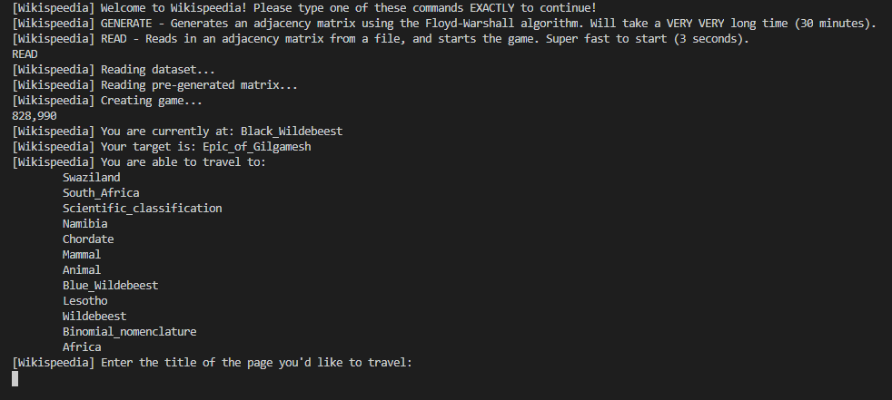

# Welcome to Wild Wikispeedia!

This is a game based on [The Wiki Game](https://www.thewikigame.com/group) and [Wikispeedia](https://dlab.epfl.ch/wikispeedia/play/). Players are given a start and a destination Wikipedia page and must navigate from the start page to the destination using the intermediary hyperlinks on each of the Wikipedia pages. In our game implementation, users can interact with the command-line to navigate forwards and backward from page to page in order to find their destination. After reaching the destination page or giving up, the user's path will be printed out alongside the most optimal (shortest) path that exists between the start and destination pages. Our game uses the [Stanford Network Analysis Project](https://snap.stanford.edu/index.html) (SNAP) [Wikispeedia data set](https://snap.stanford.edu/data/wikispeedia.html) which consists of over 4000 nodes (Wikipedia pages) and almost 120,000 edges (connections between pages).

## How to Play
In order to play the game, you must first build the project by using the ./make command and then run the executable file with ./wiki. After running these commands you will be able to interact with the game using the command line.

## Algorithms
In our project implementation, we used two main algorithms on our Wikispeedia data set. The first algorithm we used was the [Floyd-Warshall algorithm](https://en.wikipedia.org/wiki/Floyd%E2%80%93Warshall_algorithm) to find the length of the most optimal path (least amount of edges) from a starting node in our graph of Wikipedia pages to a destination node. We accomplished this by generating an adjacency matrix that held the optimal path lengths from every possible start node to every possible destination node. This allowed us to determine if a potential start page and end page for a random game were valid (the nodes were connected in our graph) and within our maximum length threshold. We then used an [iterative deepening depth-first search](https://en.wikipedia.org/wiki/Iterative_deepening_depth-first_search) that was optimized using the max depths given by Floyd-Warshall to determine the edges that compose the most optimal path from a start to a destination page. This allowed us to find the most optimal traversal path and display it to users after they successfully reach their destination or when they give up. 

## Images
Here are a few images that display our command-line interface and how users will interact with our game!

## Notes
- The initial goals of our project can be found in [CS 225 Final Project Goals.pdf](https://github-dev.cs.illinois.edu/cs225-fa20/muhila2-aidants2-ckesan2-sarishd2/blob/master/CS%20225%20Final%20Project%20Goals.pdf)
- Information about development can be found in [DEVELOPMENT.md](https://github-dev.cs.illinois.edu/cs225-fa20/muhila2-aidants2-ckesan2-sarishd2/blob/master/DEVELOPMENT.md)
- The final results of our project are outlined in [Results.pdf](https://github-dev.cs.illinois.edu/cs225-fa20/muhila2-aidants2-ckesan2-sarishd2/blob/master/RESULTS.pdf)
